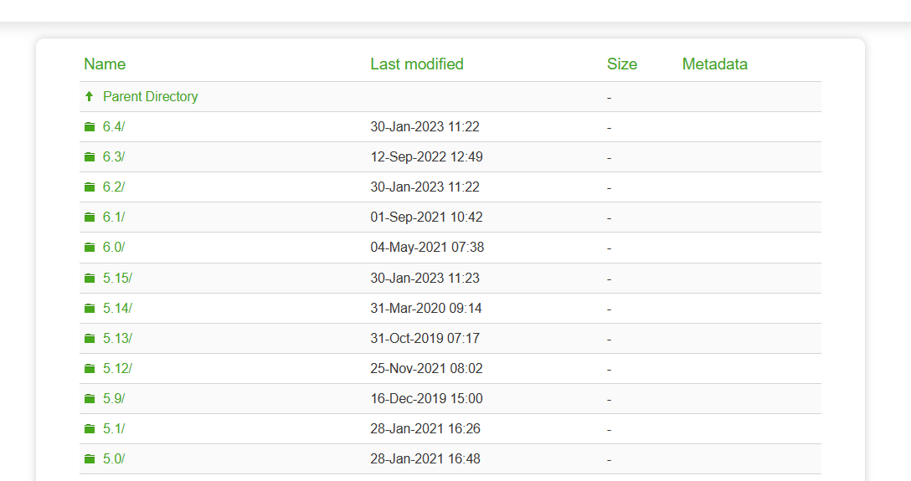
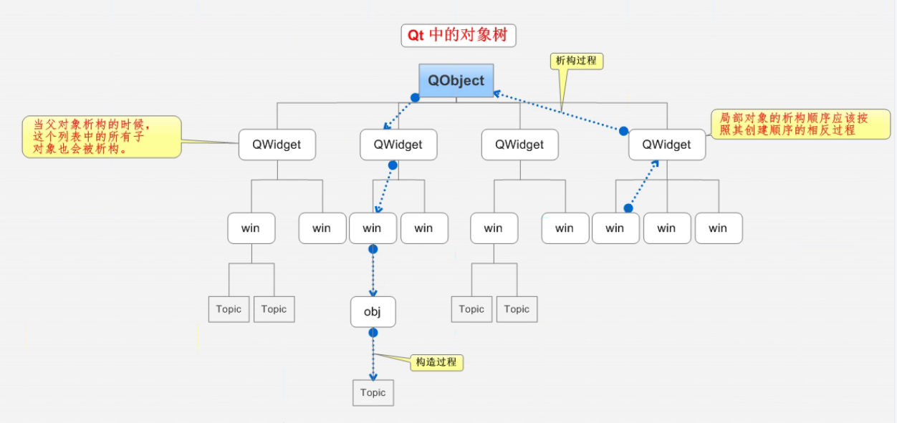

### 1. Qt概述

#### 1.1 什么是Qt

Qt是一个**跨平台**的C++**图形用户界面应用程序框架**。它为应用程序开发者提供建立艺术级图形界面所需的所有功能。它是完全面向对象的，很容易扩展，并且允许真正的组件编程。

#### **1.2** **Qt的发展史**

- 1991年 Qt最早由奇趣科技开发

- 1996年 进入商业领域，它也是目前流行的Linux桌面环境KDE的基础

- 2008年 奇趣科技被诺基亚公司收购，Qt称为诺基亚旗下的编程语言

- 2012年 Qt又被Digia公司收购

- 2014年4月 跨平台的集成开发环境Qt Creator3.1.0发布，同年5月20日配发了Qt5.3正式版，至此Qt实现了对iOS、Android、WP等各平台的全面支持。

当前Qt最新版本为 5.8.0

#### **1.3 支持的平台**

- Windows – XP、Vista、Win7、Win8、Win2008、Win10

- Unix/X11 – Linux、Sun Solaris、HP-UX、Compaq Tru64 UNIX、IBM AIX、SGI IRIX、FreeBSD、BSD/OS、和其他很多X11平台

- Macintosh – Mac OS X

- Embedded – 有帧缓冲支持的嵌入式Linux平台，Windows CE

#### **1.4** **Qt版本**

Qt按照不同的版本发行，分为商业版和开源版

- 商业版

为商业软件提供开发，他们提供传统商业软件发行版，并且提供在商业有效期内的免费升级和技术支持服务。

- 开源的(L)GPL版本：

为了开发自有而设计的开放源码软件，它提供了和商业版本同样的功能，在GNU通用公共许可下，它是免费的。

#### **1.5 Qt的下载与安装**

##### **1.5.1 下载地址：**

[Index of /archive/qt](https://download.qt.io/archive/qt/)



### 2. 元对象系统

#### 2.1 什么是元对象

Qt的元对象系统（meta-object）提供了用于内部对象通讯的信号与槽（signals & slots）机制，运行时类型信息，以及动态属性系统（dynamic property system）。

整个元对象系统基于三个东西建立：

1. **QObject**类为所有对象提供了一个基类，只要继承此类，那创建出的对象便可以使用元对象系统。
2. 在声明类时，将**Q_OBJECT**宏放置于类的私有区域就可以在类中使能元对象特性，诸如**动态属性，信号，以及槽**。*一般实际使用中，我们总是把**Q_OBJECT**宏放置在类声明时的开头位置，除此之外我们的类还需要继承**QObject**类*。
3. **元对象编译器**（Meta-Object Compiler，缩写moc），为每个QObject的子类提供必要的代码去实现元对象特性。*我们可以认为Qt对C++进行了一些拓展，moc则是负责将这些拓展语法翻译成原生的C++语法，之后交给C++编译器去编译*。

**moc**工具读取c++源文件。如果它找到一个或多个包含[Q_OBJECT](https://so.csdn.net/so/search?q=Q_OBJECT&spm=1001.2101.3001.7020)宏的类声明，它会生成另一个c++源文件，其中包含每个类的元对象代码。生成的源文件要么#include到类的源文件中，要么(更常见的情况)编译并链接到类的实现（UI Widget）。

#### 2.2 元对象操作

除了提供对象之间通信的信号和槽机制(引入系统的主要原因)，元对象代码还提供了以下附加特性:

- **QObject::metaObject()**

    此方法可以用于获取类中绑定的元对象。

- **QMetaObject::className()**

    此方法可以在运行时获取类的名字（以字符串形式），而不需要通过c++编译器提供的本机运行时类型信息(RTTI)支持。

- Q**Object::inherits()**

    此方法用于判断某个对象是否是某个类的实例，要使用此方法，这个类或者它的父类必须继承自QObect类。

- **QObject::tr()**以及**QObject::trUtf8()**

    这两个方法用于翻译字符串以方便实现**国际化**。*大概是用于给应用程序设置多套语言的，没用过。*

- **QObject::setProperty()**和**QObject::property()**

    根据名称动态设置和获取属性。

- **QMetaObject::newInstance()**

    用于构造一个新的QObject实例对象。

#### 2.3 动态类型转换

可以对[QObject](https://so.csdn.net/so/search?q=QObject&spm=1001.2101.3001.7020)类使用**qobject_cast()**执行动态类型转换。**qobject_cast()**函数的行为类似于标准的c++ dynamic_cast()，其优点是它不需要**RTTI**支持，并且可以跨动态库边界工作。它尝试将其参数强制转换为尖括号中指定的指针类型，如果对象的类型正确(在运行时确定)，则返回一个非零指针，如果对象的类型不兼容，则返回nullptr。

比如在自定义控件或者自定义类型时，举例**MyWidget**继承自**QWidget**，并使用**Q_OBJECT**宏声明：

```C++
QObject *obj = new MyWidget;
```

类型为QObject *的obj变量实际上引用了一个MyWidget对象，因此我们可以适当地转换它：

```C++
QWidget *widget = qobject_cast<QWidget*>(obj);
```

从QObject转换到QWidget是成功的，因为对象实际上是一个MyWidget，它是QWidget的一个子类。因为我们知道obj是一个MyWidget，我们也可以将它强制转换为MyWidget *：

```C++
// 以下两种都可以
MyWidget *myWidget = qobject_cast<MyWidget*>(obj);
MyWidget *myWidget = qobject_cast<MyWidget*>(widget);
```

qobject_cast()没有区分内置Qt类型和自定义类型。*也就是说**只要是继承了QObject类，并在类声明时使用了Q_OBJECT宏定义，那么哪怕是自定义得类也可以借助这套机制进行类型转换。**这个东西可以类比于C语言中借助void类型的指针实现的动态类型转换，不过Qt的这套机制由于存在类型检查，比C语言的指针可安全得多了*。

```C++
// 以下操作会失败，返回nullptr
QLabel *label = qobject_cast<QLabel*>(obj);
```

在整个元对象系统中，存在一颗类型树。利用多态的机制，可以进行运行时的不同处理。

```
// 针对obj对象的不同类型设置不同的文本显示
if (QLabel *label = qobject_cast<QLabel *>(obj)) 
{
	label->setText(tr("Ping"));
} 
else if (QPushButton *button = qobject_cast<QPushButton *>(obj)) 
{
	button->setText(tr("Pong!"));
}
```

注意事项：

没有使用**Q_OBJECT宏**和**元对象代码**的情况下使用**QObject**作为基类，但如果没有使用**Q_OBJECT**宏，**信号和插槽以及这里描述的其他特性都是不可用的**。从元对象系统的角度来看，一个没有元代码的QObject子类相当于它有元对象代码的最近的祖先。这意味着，例如，**QMetaObject::className()**将不会返回您的类的实际名称，而是这个祖先的类名称。

因此，强烈建议**QObject**的所有子类都使用Q_OBJECT宏，无论它们是否实际使用信号、插槽和属性。

#### 2.4 对象树



### 3. 属性系统

#### 3.1 什么是属性系统

如同很多编译器厂商提供的编译器一样，Qt也提供了一个精妙的属性系统。然而，作为一个独立于编译器和架构的库，Qt不依赖于诸如__property或[property]这样的非标准的编译器特性。Qt的这套属性系统特性可以用于任何Qt支持的编译器与架构。它基于元对象系统（Meta-Object System），这套系统同时也提供信号与槽机制用于对象间通讯。

**属性与成员变量的区别：**

```bash
# 成员变量是一个“内”概念，反映的是类的结构构成。属性是一个“外”概念，反映的是类的逻辑意义。
# 成员变量没有读写权限控制，而属性可以指定为只读或只写，或可读可写。
# 成员变量不对读出作任何后处理，不对写入作任何预处理，而属性则可以。
# public成员变量可以视为一个可读可写、没有任何预处理或后处理的属性。 而private成员变量由于外部不可见，与属性“外”的特性不相符，所以不能视为属性。
# 虽然大多数情况下，属性会由某个或某些成员变量来表示，但属性与成员变量没有必然的对应关系， 比如与非门的 output 属性，就没有一个所谓的 $output 成员变量与之对应。
```

#### 3.2 属性的声明要求

在继承了**QObject**的类中使用Q_PROPERTY宏定义即可声明属性。下面说明了此宏定义的使用格式：

- **type**，**name**，以及位于"()"括号中的内容为**必须存在**的。

- 括号中使用“|”隔开的部分为可选择项，至少应该使用其中的一项.
- 使用”[]“包裹的选项为**可选项目**。

```C++
Q_PROPERTY(type name
            (READ getFunction [WRITE setFunction] |
             MEMBER memberName [(READ getFunction | WRITE setFunction)])
            [RESET resetFunction]
            [NOTIFY notifySignal]
            [REVISION int]
            [DESIGNABLE bool]
            [SCRIPTABLE bool]
            [STORED bool]
            [USER bool]
            [CONSTANT]
            [FINAL])
```

**QWidget类中的属性声明例子：**

```C++
// 声明一个布尔类型的，名为focus的属性，可以通过hasFocus方法作为访问器进行读取
Q_PROPERTY(bool focus READ hasFocus)
    
// 声明一个布尔类型的，名为enabled的属性，可以通过isEnabled方法读取，通过setEnabled方法写入
Q_PROPERTY(bool enabled READ isEnabled WRITE setEnabled)

// 声明一个QCursor类型的，名为cursor的属性，可以通过setCursor方法读取，通过unsetCursor方法写入
Q_PROPERTY(QCursor cursor READ cursor WRITE setCursor RESET unsetCursor)
```

**一个使用属性的例子：**

```C++
Q_PROPERTY(QColor color MEMBER m_color NOTIFY colorChanged)
Q_PROPERTY(qreal spacing MEMBER m_spacing NOTIFY spacingChanged)
Q_PROPERTY(QString text MEMBER m_text NOTIFY textChanged)
```

上述方式和下面这种方式等价：

```C++
 signals:
     void colorChanged();
     void spacingChanged();
     void textChanged(const QString &newText);

 private:
     QColor  m_color;
     qreal   m_spacing;
     QString m_text;
```

**属性系统在QML中使用频繁，通过配合属性绑定，QML可以在绑定的控件对象属性发生变化时，通过WRITE关键字指定的访问器自动更新绑定的属性的值，或者在属性发生改变从而发出SIGNAL指定的信号时，通过READ访问器自动将属性的值更新到绑定的控件对象。**


- **如果没有指定MEMBER变量，则需要READ访问器方法。它用于读取属性值。理想情况下，const函数（const函数保证不会修改类中的数据成员）可用于此目的，并且它必须返回属性的类型或对该类型的const引用。例如，QWidget::focus是一个带有READ方法QWidget::hasFocus()的只读属性。**
- **WRITE访问器函数是可选的。用于设置属性值。它必须返回void，并且必须接受一个实参，要么是属性的类型，要么是指向该类型的指针或引用。例如，QWidget::enabled具有WRITE函数QWidget::setEnabled()。只读属性不需要WRITE函数。例如，QWidget::focus没有WRITE功能。**
- **如果没有指定READ访问器函数，则需要关联MEMBER变量。这使得给定的成员变量可读可写，而不需要创建READ和WRITE访问器函数。如果需要控制变量访问，除了MEMBER变量关联之外，还可以使用READ或WRITE访问器函数(但不能同时使用两者)。\*这里可以理解为使用MEMBER关键字关联一个变量为属性时，Qt会自动生成默认的READ和WRITE方法。\***
- **NOTIFY功能是可选的。如果定义了它，应该在类中指定一个现有信号，每当属性的值发生变化时（一般为调用WRITE访问器更新属性时），该信号需要被发出。MEMBER变量的NOTIFY信号必须接受0或1个参数，这些参数存储了变化后的数值并与MEMBER变量类型相同。NOTIFY信号只应该在属性真正更改时发出，以避免在QML中不必要地重新计算绑定。当MEMBER属性没有显式的WRITE访问器时，Qt会自动发出这个信号。**

#### 3.3 使用元对象系统读写属性

使用通用的**QObject::property()**和QObject::setProperty()方法可以在只知道属性名字的情况下读写属性。

```C++
 //以下例子中，当我们使用object对象指针访问对象时，我们只知道这个对象继承了QObject，但是只要知道属性名字，依然可以正常访问属性。
class QMyPushButton : public QPushButton
{
    Q_OBJECT // 加入元对象系统
public:
    Q_PROPERTY(QString name READ name WRITE setName)
    QMyPushButton() {}
	void setName(const QString& name){
        m_name= name;
    };
    QString name() const
    { 
        return m_name; 
    };
private:
	QString m_name;    
}; 

QMyPushButton *button = new QMyPushButton;
button->setName("btn01");
object->setProperty("name", "mybtn");
auto btnName = object->property("name");
```

推荐通过属性的WRITE访问器访问属性，因为它更快，并且支持在编译阶段进行诊断，但是通过这种方式设置属性需要您在编译时了解类。通过名称访问属性使您可以访问在编译时不知道的类。您可以在运行时通过查询类的**QObject**、**QMetaObject**和**QMetaProperties**来查询类的属性。

```C++
//以下例子中object指针指向了某个继承自QObject类的对象，之后通过访问元对象系统的相关对象查询属性的总数，并遍历这些属性获取属性名称与属性值。 
QObject *object = ...
 const QMetaObject *metaobject = object->metaObject();
 int count = metaobject->propertyCount();
 for (int i=0; i<count; ++i) {
     QMetaProperty metaproperty = metaobject->property(i);
     const char *name = metaproperty.name();
     QVariant value = object->property(name);

 }

```

#### 3.4 声明属性并读写属性的综合例子

假设我们有一个类MyClass，它派生自QObject，并在其私有部分中使用Q_OBJECT宏。我们希望在MyClass中声明一个属性来跟踪优先级值。该属性的名称将是priority，其类型将是一个名为priority的枚举类型，它在MyClass中定义。

我们在类的private部分使用**Q_PROPERTY()**宏声明该属性。所需的READ函数名为priority，我们还包括一个名为setPriority的WRITE函数。枚举类型必须使用**Q_ENUM()**宏向元对象系统注册。注册枚举类型使枚举器的名称可在调用QObject::setProperty()时使用*（设置属性类型时，直接输入字符串格式的枚举名称即可将对应的枚举值赋值给属性，后面调用演示的代码段中会看到使用示例）*。我们还必须为READ和WRITE函数提供自己的声明。然后MyClass的声明可能像这样:

```C++
class MyClass : public QObject
{
    Q_OBJECT
    Q_PROPERTY(Priority priority READ priority WRITE setPriority NOTIFY priorityChanged)

public:
    MyClass(QObject *parent = 0);
    ~MyClass();

    enum Priority { High, Low, VeryHigh, VeryLow };

    //向元对象系统注册枚举，后面使用setPriority时就可以直接使用枚举名称来映射枚举值
    Q_ENUM(Priority) 

        void setPriority(Priority priority)
    {
        m_priority = priority;
        emit priorityChanged(priority);
    }

    //const函数，声明方法为const方法表明此方法不会改动类中的数据成员变量
    Priority priority() const
    { 
        return m_priority; 
    }

signals:
    void priorityChanged(Priority);

private:
    Priority m_priority;
};


MyClass *myinstance = new MyClass;
QObject *object = myinstance;

myinstance->setPriority(MyClass::VeryHigh);

//前面使用了Q_ENUM宏定义注册了枚举名字，这样我们就可以直接传入字符串格式的枚举名字，元对象系统会自动给属性赋值名字对应的枚举值
object->setProperty("priority", "VeryHigh");

```

#### 3.5 动态属性

QObject::setProperty()还可以用于在运行时向类的实例添加新属性

**注意事项：**动态属性是在每个实例基础上添加的，也就是说，它们被添加到QObject，而不是QMetaObject。可以通过将属性名称和无效的QVariant值传递给QObject::setProperty()来从实例中删除属性。QVariant的默认构造函数会构造一个无效的QVariant。

可以使用**QObject::property()**查询动态属性，就如同使用**Q_PROPERTY()**在编译时声明的属性一样。

#### 3.6 使用自定义类型创建属性

属性使用的自定义类型需要使用**Q_DECLARE_METATYPE()**宏注册，以便它们的值可以存储在**QVariant**对象中。这样一来，它们就可以用于使用**Q_PROPERTY**创建的静态属性，或者运行时创建的动态属性。

```C++
 // 注册一个结构体类型
 struct MyStruct
 {
     int i;
     ...
 };

 Q_DECLARE_METATYPE(MyStruct)

// 如果存在命名空间，Q_DECLARE_METATYPE宏必须位于命名空间外，并且注册时指明类型所处的命名空间 
 namespace MyNamespace
 {
     ...
 }

 Q_DECLARE_METATYPE(MyNamespace::MyStruct)

```

#### 3.7 向类添加额外的信息

属性系统附带一个名为Q_CLASSINFO()的宏，它可用于将附加的名值对附加到类的元对象上：

```c
Q_CLASSINFO("Version", "3.0.0")
```

类信息可以如同其他元数据（meta-data）一样在运行时使用QMetaObject::classInfo()访问。


### 4. 信号槽机制

信号槽是 Qt 框架引以为豪的机制之一。所谓信号槽，实际就是观察者模式。**当某个事件发生之后**，比如，按钮检测到自己被点击了一下，**它就会发出一个信号（signal）**。这种发出是没有目的的，类似广播。**如果有对象对这个信号感兴趣，它就会使用连接（connect）函数**，意思是，**将想要****处理的信号和****自己的一个函数（称为槽（slot））绑定来处理这个信号**。也就是说，**当信号发出时，被连接的槽函数会自动被回调**。这就类似观察者模式：当发生了感兴趣的事件，某一个操作就会被自动触发。

#### 4.1 信号（Signals）

当对象的内部状态以某种方式发生变化时，对象的客户或所有者可能会感兴趣，该对象就会发出信号。信号是公共访问函数*（public的）*，可以从任何地方发出，但我们建议只从定义信号及其子类的类中发出信号*（只建议在定义了信号的类中发出信号，或者从继承了此类的子类中发出信号）*。当发出一个信号时，连接到它的插槽通常会立即执行，就像普通的函数调用一样。当发生这种情况时，信号和插槽机制完全独立于任何GUI事件循环。一旦所有插槽都返回，就会执行emit语句后面的代码。当使用排队连接*（queued connections，可以简单理解为使用一个队列缓需要执行的槽函数，这样就可以延迟执行了，有点像linux中使用异步方法进行文件IO）*时，情况略有不同;在这种情况下，emit关键字后面的代码将立即继续，稍后将执行插槽。**（一般如果直接连接，槽函数会立刻在接收者的线程中执行，而使用排队连接，槽函数会在接收信号的对象线程开始执行时执行。）**

- 定义在类的signals域下
- 普通void函数
- 只有声明，没有实现，可以带参数，可以重载
- 通过emit obj->signal_function()方式触发信号

#### 4.2 槽（Slots）

槽将会在连接到的信号发出时被调用。槽其实就是正常的C++方法，因此也可以被正常调用，唯一的不同就是它们可以连接到信号。

由于slot是普通的成员函数，当直接调用时，它们遵循普通的c++规则。但是，作为插槽，它们可以通过信号插槽连接被任何组件调用，而不管其访问级别如何。这意味着从任意类的实例发出的信号可能导致在不相关类的实例中调用私有槽。***就算一个槽声明为private，当它连接到信号，发出信号的类也可以正常调用这个槽，这有点像将一个类的private的成员变量导出为属性以使得其他类的实例可以访问它**。*还可以将槽定义为虚函数，这在实践中非常有用。

一个简单的信号槽类：

```C++
#include <QObject>
class Counter : public QObject
{
    Q_OBJECT // 加入元对象系统
public:
    Counter() { m_value = 0; }
    int value() const { return m_value; }

public slots:
    void setValue(int value); // 槽函数

signals:
    void valueChanged(int newValue); //值改变信号，一把在执行setValue时emit发送出去

private:
    int m_value;
};
```

#### 4.3 如何连接信号和槽

- 只有类型相同的信号和槽才能连接
- 一个信号可以连接多个槽，一个槽连接多个信号。

##### 4.3.1 Q4 版本使用

```C++
QObject::connect(const QObject *sender, const char *signal, const QObject *receiver, const char *method, Qt::ConnectionType type = Qt::AutoConnection)
```

**sender**：指定信号的发送者；
**signal**：指定信号函数，信号函数必须用 SIGNAL() 宏括起来；
**reveiver**：指定信号的接收者；
**method**：指定接收信号的槽函数，槽函数必须用 SLOT() 宏括起来； type
用于指定关联方式，默认的关联方式为 **Qt::AutoConnection**，通常不需要手动设定。

注意事项：

**在借助SIGNAL和SLOT宏使用这个QObject::connect()重载时，编译器不会检查signal和slot参数。**

##### 4.3.2 Qt5 版本使用


```C++
QObject::connect(const QObject *sender, PointerToMemberFunction signal, const QObject *receiver, PointerToMemberFunction method, Qt::ConnectionType type = Qt::AutoConnection)
```

旧版本相比，新版的 connect() 函数改进了指定信号函数和槽函数的方式，不再使用 SIGNAL() 和 SLOT() 宏。

比如用新版 connect() 函数关联 But 按钮的 clicked() 信号函数和 widget 窗口的 close() 槽函数，实现代码为：

```C++
connect(&But, &QPushButton::clicked, &widget, &QWidget::close);
```

槽函数的连接方式：

connect() 函数只能关联一个信号函数和一个槽函数

- 一个信号函数关联多个槽函数

    一个信号函数可以关联多个槽函数，当信号发出时，与之关联的槽函数会一个接一个地执行，但它们执行的顺序是随机的，无法人为指定哪个先执行、哪个后执行

- 多个信号函数和多个槽函数

    多个信号函数可以关联同一个槽函数，无论哪个信号发出，槽函数都会执行。

- 信号的传递

    一个信号可以连接另一个信号，当前一个信号发射时会自动触发后一个信号，信号可以通过该方式传递下去。

    ```C++
    QObject::connect(btn,SIGNAL(信号…),this,SIGNAL(信号…));
    ```

##### 4.3.3 **断开信号和槽的连接**

QObject::disconnect(参数和connect完全一致); //对象销毁时自动断开信号和槽，该函数几乎不用

##### 4.3.4 信号和槽的进阶用法

- 对于需要信号发送方信息的情况，Qt提供了QObject::sender()函数，它返回一个指向发送信号的对象的指针。

    ```C++
    Counter* counter = qobject_cast<Conuter*>( QObject::sender());
    if(counter){
        //do something
    }
    ```

- lambda表达式是一种便捷的方法，可以用于传递用户自定义参数到一个槽：

    ```C++
    // 使用lambda表达式我们可以直接访问到发送者action，这样就可以不使用QObject::sender()函数了
    connect(action, &QAction::triggered, engine, [=]() { engine->processAction(action->text()); });
    ```

#### 4.4 connect的第五个参数

Qt支持6种连接方式，其中3种最主要:

- **Qt::AutoConnection（自动方式）**
    Qt的默认连接方式，如果信号的发出和接收这个信号的对象同属一个线程，那个工作方式与直连方式相同；否则工作方式与排队方式相同
- **Qt::DirectConnection（直接连接）（同步）**
    当信号发送后，相应的槽函数将立即被调用。emit语句后的代码将在所有槽函数执行完毕后被执行。
- **Qt::QueuedConnection（排队连接）（异步）**
    当信号发出后，排队到信号队列中，需等到接收对象所属线程的事件循环取得控制权时才取得该信号，调用相应的槽函数。emit语句后的代码将在发出信号后立即被执行，无需等待槽函数执行完毕。多线程环境下可使用。
- **Qt::BlockingQueuedConnection**(阻塞连接，信号和槽必须在不同的线程中，否则就产生死锁)
    发送信号后发送者所在的线程会处于阻塞状态 ，直到槽函数运行完。多线程同步环境下可使用。
- Qt::UniqueConnection
    与默认工作方式相同，只是不能重复连接相同的信号和槽，因为如果重复连接就会导致一个信号发出，对应槽函数就会执行多次。这个flag可以通过按位或（|）与以上四个结合在一起使用
- **Qt::AutoCompatConnection**
    是为了连接Qt4与Qt3的信号槽机制兼容方式，工作方式与Qt::AutoConnection一样。

**注意事项：**
		**默认情况下采用直连方式相同：当信号发出后，相应的槽函数将立即被调用。emit语句后的代码将在所有槽函数执行完毕后被执行。在这个线程内是顺序执行、同步的，但是与其它线程之间肯定是异步的了。如果使用多线程，仍然需要手动同步。**

#### 4.5 自定义类型作为参数

Qt的信号和槽可以传递int、double等c++常用类型变量，也可以传递**QVector**、**QMap**等Qt的容器类（当然也可以传递Qt定义的类型）。

##### 4.5.1 如何传递自定义的结构体

首先在定义结构体的同时需要使用**Q_DECLARE_METATYPE**。通过这个宏定义可以将自定义的类型注册到Qt的元类型中，从而被Qt识别。参考3.6章节。例子如下：

```C++
struct PersonInfo
{
    QString Name;
    int age;
};
Q_DECLARE_METATYPE(PersonInfo)
```

##### 4.5.2 多线程信号槽传递自定义参数

举例:想要使用信号传递double数组

**信号：**

```C++
void signal_double(QList<double>);
```

**编译&运行：**会提示下列错误

```C++
Object::connection: Cannot queue arguments of type 'QList<double>'
(Make sure 'QList<double>' is registered using qRegisterMetaType().))
```

在自定义的数据类型作为信号槽参数传递的时候，需要使用 **qRegisterMetaType()** 函数对该参数进行注册

**解决：**

```C++
//添加头文件 
#include <QMetaType>
qRegisterMetaType<QList<double> > ("QList<double>");
```

**注意事项：**：在哪儿连接信号和槽，在哪儿注册。

##### 4.6.1 信号槽注意事项：

信号和槽机制增强了对象间通信的灵活性，然而这也损失了一些性能。与回调函数相比较，信号和槽机制有些慢。通常，通过传递一个信号来调用槽函数将会比直接调用**非虚函数慢10倍****。原因主要有：**

**● 需要**定位接收信号的对象；
● 安全地遍历所有的关联（比如，一个信号关联到多个槽的情况）；
● 编组（marshal）/解组（unmarshal）传递的参数；
● 多线程的时候，信号可能需要排队等待。
然而，与创建堆对象的new操作以及删除堆对象的delete操作相比较，信号和槽的代价只是它们很少的一部分。信号和槽机制导致的这点性能损耗，对实时应用程序是可以忽略的。与信号和槽提供的灵活性和简便性相比，这点性能的损失也是值得的。


### 5.消息机制

5.1 事件分发机制

5.2 常用事件处理

### 6.窗口控件

6.1 窗口基类

6.2 常用控件

6.3 自定义控件

### 7.绘图系统